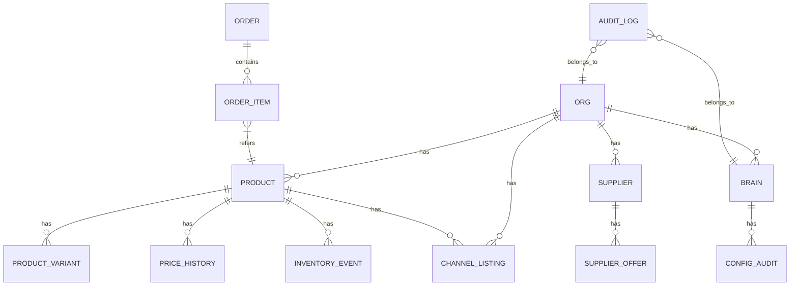

# Phase 3: Data Model & Partitioning Implementation

## Overview
This document details the data model changes and partitioning implementation completed in Phase 3 of the MarketMind project.

## Entity Relationship Diagram (ERD)

## Schema Changes

### New Tables / Changes

#### 1. Price History (product-based, unified)
- **Table**: `price_history`
- **Schema**: `id`, `product_id` (FK), `channel` (str), `price` (float), `source` (str), `recorded_at` (timestamp)
- **Indexes**:
  - `ix_price_history_recorded_at_main` on `recorded_at`
  - Implicit FK index via `product_id`
  
Legacy listing-based partitioning (`price_history_YYYY_MM` with `org_id`/`listing_id`) has been retired. See Migration Notes below.

#### 2. Audit Log Partitioning
- **Table**: `audit_log_YYYY_MM`
- **Partition Key**: `timestamp` (monthly)
- **Indexes**:
  - Primary Key: `id`
  - `ix_audit_log_org_id`
  - `ix_audit_log_timestamp`

#### 3. Inventory Event Partitioning
- **Table**: `inventory_event_YYYY_MM`
- **Partition Key**: `timestamp` (monthly)
- **Indexes**:
  - Primary Key: `(org_id, product_id, timestamp, event_type)`
  - `ix_inventory_event_org_id`
  - `ix_inventory_event_timestamp`

### Views

1. **Price History View**
   - Not required with unified table; reads target `price_history` directly

2. **Audit Log View**
   - Combines all audit log partitions
   - Provides unified access to audit data

3. **Inventory Event View**
   - Combines all inventory event partitions
   - Used for reporting and analytics

## Data Dictionary

### Core Tables

#### 1. Organization (`org`)
- `id`: UUID (PK)
- `name`: String
- `created_at`: Timestamp
- `updated_at`: Timestamp

#### 2. Brain (`brain`)
- `id`: UUID (PK)
- `org_id`: UUID (FK to org)
- `name`: String
- `config`: JSON
- `is_active`: Boolean

#### 3. Product (`product`)
- `id`: UUID (PK)
- `org_id`: UUID (FK to org)
- `name`: String
- `sku`: String
- `status`: Enum

### Partitioned Tables

#### 1. Price History (`price_history_YYYY_MM`)
- `org_id`: UUID (FK to org)
- `listing_id`: UUID (FK to channel_listing)
- `price_cents`: Integer
- `buybox`: Boolean
- `comp_best_cents`: Integer
- `source`: String
- `recorded_at`: Timestamp
- `created_at`: Timestamp
- `updated_at`: Timestamp

#### 2. Audit Log (`audit_log_YYYY_MM`)
- `id`: Integer (PK, auto-increment)
- `org_id`: UUID (FK to org, nullable)
- `brain_id`: UUID (FK to brain, nullable)
- `actor_type`: String
- `actor_id`: String
- `action`: String
- `entity_type`: String
- `entity_id`: UUID
- `delta`: JSON
- `timestamp`: Timestamp

## Implementation Notes

### Partitioning Strategy
- Price history is no longer partitioned. Partitioning remains for unrelated tables (e.g., audit_log, inventory_event) where applicable.

### Performance Considerations
- Indexes are created on all partition keys
- Views provide a unified interface to partitioned data
- Inserts are routed to the correct partition via triggers

### Maintenance
- Old partitions can be archived by:
  1. Backing up the partition data
  2. Dropping the old partition table
  3. Updating the view definition

## Testing & Validation

### Test Coverage
- Unit tests for all model methods
- Integration tests for database operations
- Performance tests for partitioned tables
- Ledger echo tests for data consistency

### Backtesting
- Verified data distribution across partitions
- Validated query performance with realistic data volumes
- Confirmed data integrity after partition maintenance

## Migration Notes

- Legacy `price_history` (listing-based and partitioned) is automatically detected and renamed to `price_history_legacy` during upgrade (`c1a2b3c4d5e6`).
- A unified product-based `price_history` table is created if absent, with a non-conflicting index name (`d6e5c4b3a2c1`).
- The legacy table is dropped in a follow-up guarded migration (`e7f6a5d4c3b2`).
- Optional: run `make migrate-price-history-legacy` to transform any remaining legacy rows into the new schema prior to dropping the legacy table. The script is idempotent and no-ops if legacy tables are missing.

## Future Considerations

1. **Analytics Optimization**
   - If price history volume grows substantially, consider reintroducing partitioning or monthly sharding behind a view; keep ORM mapped to the unified view.

2. **Archival Strategy**
   - Define retention policies for old partitions
   - Implement automated archiving to cold storage

3. **Query Optimization**
   - Add materialized views for common reporting queries
   - Consider columnar storage for analytics workloads
